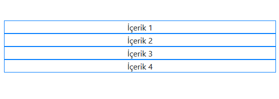

## Bootstrap Grid Yapısı

  |Extra small (<576px)|Small (≥576px)|Medium(≥768px)|Large(≥992px)|Extra large(≥1200px)
------------|-------------|------------|-------------|------------|-------------|
Max container width |None (auto)|540px|720px|960px|1140px
Class prefix|.col-|.col-sm-| 	.col-md-|.col-lg-|.col-xl-

Aşağıda belirtilen class'lar birlikte kullandığı zaman içeriklerinizin telefon,tablet,bilgisayar vb. ekranlarda nasıl görüntüleceğinizi ayarlamanızı sağlıyor.Responsive tasarımlar çıkarmanıza yardımcı oluyor.


#### Extra small

576px den küçük ekranlarda görüntülecek ayardır.Kullanımı için ```<div class="col-12">``` kodunu kullanabiliriz.Buradaki 12 576px'den küçük ekrana geldiği zaman içerğimizin ekrana yayılmasını sağlayacaktır.

#### Small
576px'den büyük, 768px'den küçük ekranlar için görüntülecek ayardır.Tek başına kullandığı zaman 576'dan büyük ekranlarda bu class'daki ayarlarımız geçerli olur.Kullanımı ```<div class="col-sm-12"``` kodunu kullanabiliriz.Extra small ile birlikte de kullanabiliriz.Örneğin ```<div class="col-12 col-sm-8">```.Buraki kodda içeriğimiz 576px'den küçük ekranlarda ekrana yayılacak , 576px'den büyük ekranlar için bir kısmı boş kalacak şekilde ekrana gelecektir.

#### Medium
768px'den büyük 992px'den küçük ekranlar için kullanılan classtır.Tek başına kullandığı zaman 768'den büyük ekranlarda bu class'daki ayarlarımız geçerli olur.Kullanımı ```<div class="col-md-12">``` şeklindedir.

#### Large
992px'den büyük ekrankar için görüntülenecek ayardır.Extra Large ile birlikte kullanılırsa 992px ve 1200px arası ekranlarda içeriğimiz gösterileceği bölümü içeririr.
Kullanımı ```<div class="col-lg-12">``` şeklindedir.

#### Extra large
1200px'den büyük ekranlar için kullanılan ayardır.Kullanımı ```<div class="col-xl-12">```şeklindedir.

Örneğin bir içeriğiniz var ve 1200px ekranlarda 4 parçaya bölünmesini 768px ile 1200px arası ekranlarda 2 parçaya bölünmesini 576px'den küçük ekranlarda tek bir alana yayılmasını istiyorsanız şöyle bir kod yazmalısınız.

```html
<div class="container">
  <div class="row">
    <div class="col-12 col-md-6 col-lg-3">İçerik 1</div>
    <div class="col-12 col-md-6 col-lg-3">İçerik 2</div>
    <div class="col-12 col-md-6 col-lg-3">İçerik 3</div>
    <div class="col-12 col-md-6 col-lg-3">İçerik 4</div>
  </div>
</div>
```
1200px'den yüksek ekranlarda içeriğimiz bu şekilde görüntülecektir.

768px ile 1200px arası ekranlar bu şekilde görüntülecektir.

768px'den küçük ekranlarda ise bu şekilde.

