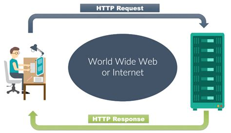
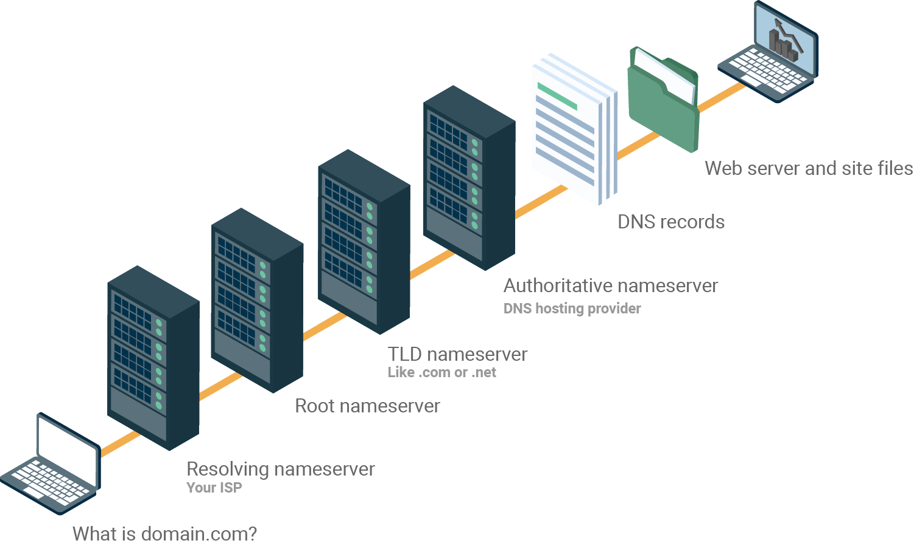
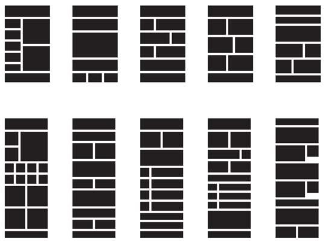

### Hyper Text Transfer Protocol - HTTP
İnternet araçlarıyla bilginin sunucudan kullanıcıya ne şekilde ve nasıl aktarılacağını belirten bir araçtır.

### World Wide Web - WWW
World Wide Web belgeler ve diğer web kaynaklarının  URL'ler tarafından tanımlandığı, köprü metin bağlantılarıyla birbirine bağlandığı ve internet
üzerinden erişilebileceği bir bilgi alanıdır.
World Wide Web internet üzerinden çok sayıda belge, bilgi, dokümanlara ulaşmak için kullanılan bir internet hizmetidir.

### Domain Name System - DNS
DNS (Domain Name System) tarayıcınızın adres çubuğuna girdiğiniz site ismini, girmek istediğiniz sitenin gerçekte ikamet
ettiği IP adresine çeviren ve internette gezinmeyi tahmin edemeyeceğiniz kadar kolaylaştıran oldukça yararlı bir
sistemdir. Örneğin hiç kimse şu anda Google'ın ikamet adresi olan 74.125.224.83 adresini tarayıcısına yazmaz.
Onun yerine www.google.com yazar ve DNS sunucusu, bu adresi IP adresine yönlendirir.

### İstemci Nedir ?
İstemci dediğimiz şey, sunucudan istekte bulunan, sunucudaki verileri kullanabilen yapılardır.Örnek olarak bir
web sayfasını verebiliriz.İstemci konumundaki web sayfası, sunucu(server) dan bir istekte bulunur ve bunun
sonucunda sunucu,istenen verileri istemciye ulaştırır.

### Sunucu Nedir ?
Sunucu ise bu bilgileri tutan bilgisayarlardır.Bunların donanımla,yüksek performansla çalışmaları gerekir.
Tanımını özet olarak yaparsak Sunucu, bir ağdaki bilgiyi kullanıcılara (bilgisayarlara) paylaştıran, üzerinde
birçok yazılım çalıştaran, yüksek performansa sahip bilgisayarlardır.

### Hyper Text Markup Language - HTML
Web programlama için gereken en temel dildir.HTML bir programlama dili değil bir betik dilidir.Html kendi başına
çalıştırılamaz, çalıştırılabilmesi için bir web tarayıcısına ihtiyac duyar.Html ile yazı,resim ve videoları birbirine
bağlayıp kullanıcılara sunabiliriz.

### CSS Nedir ?
CSS (Cascading Style Sheet) basit ve kullanışlı bir işaretleme dilidir. CSS diğer bir adıyla Stil şablonları
yazı,resim, bağlantı, kenar çizgileri vb. HTML öğelerine sitil vermek yani biçimlendirmek için kullanılır.
CSS kullanımı sayesinde yüzlerce sayfayı tek bir dosya ile biçimlendirebiliriz. Bu sayede hızlı ve esnek web
sayfaları oluşturabiliriz.

### JAVASCRIPT Nedir ?
JavaScript bize etkileşimli ve dinamik web sayfaları hazırlama imkanı vermektedir. Sözdizimi Java’ya benzese
de Java ve JavaScript birbirinden farklı teknolojilerdir.

### Genel HTTP Yaşam Döngüsü
1. Girilen domain IP adresine çevrilir (DNS)
2. IP adresine TCP bağlantısı (request) açılır
3. Server cevap (response) döner
4. Cevap render edilir

### Domainin IP ‘ye çevrilmesi (DNS)
Tarayıcıya girilen domain (örneğin: www.google.com.tr)
DNS sunucularına sorularak IP adresi bulunur.
Eğer tarayıcı daha önce DNS sorgulaması yaptıysa aynı
domaine istek yapıldığında DNS sorgusu tekrar yapılmaz.
Bu, websitesi hız testlerinde -bir sayfada farklı domainlere
yapılan istekler için- DNS lookup time kriteri olarak
önümüze çıkar.

### IP adresine TCP isteği (request)
Bulunan IP adresine TCP bağlantısı açılıp (request) girilen
domain host header’ı ile gönderilir
Bu örnek için gönderilecek bilgiler aşağıdaki gibidir;
GET / HTTP/1.1
Host: www.google.com
Burada kullanıcının istediği sayfa anasayfa olduğundan “/”
parametresi GET metodu ile gönderilmiştir.

### Server ‘ın cevabı (response)
IP adresinde bulunan server, isteği işleyip cevap
(response) döner.
Server bu isteği işlerken port bilgisine bakarak ilgili web
sunucusuna (iis, apache, nginx) yönlendirir.
Web sunucusu gelen host header’ı ile hangi siteyi
çalıştıracağına karar verip ilgili sitenin kodunu işletir.

### Cevabın ekrana basılması (render)
Cevabı alan browser gelen cevabı ekrana basar (render).
Browser render işleminde html ile layout’u, css ile tasarımı
(renk, imaj vd) oluşturur.
Javascript ise yukarıdaki işlemler yapıldıktan sonra hem
css hem html üzerinde (DOM) değişiklikler yaparak sayfaya
dinamik bir yapı kazandırır.
