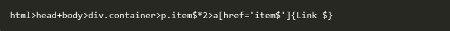
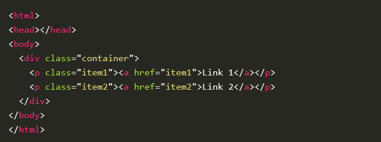
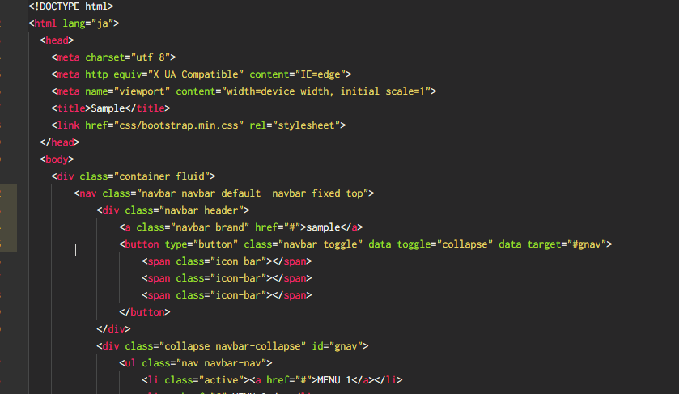

# Atom Eklentileri
## [Emmet](https://atom.io/packages/emmet)
Kısa yolları kullanarak hızlı bir şekilde HTML kodları yazmamızı sağlıyor.Örneğin:```ul>(li>a{Menu Linki})*5``` yazıp tab tuşuna basarsanız aşağıda ki kodlar oluşacaktır.
```html
<ul>
   <li><a href="">Menu Linki</a></li>
   <li><a href="">Menu Linki</a></li>
   <li><a href="">Menu Linki</a></li>
   <li><a href="">Menu Linki</a></li>
   <li><a href="">Menu Linki</a></li>
 </ul>
```
Bunu yazarsak:



Bunu elde ederiz:




***
## [Minimap](https://atom.io/packages/minimap)
Sayfanın tam kaynak kodunu ekranın sağ üstünde göstermek için kullanılır.


***

## [Highlight Selected](https://atom.io/packages/highlight-selected)
Highlight-selected, Sublime Text veya Notepad++ gibi anahtar kelimenin veya değişkenin üzerine çift tıkladığınızda aynı kelimeleri çerceve içine alır. Aynı kelimeleri hızlı ve güvenilir bir şekilde bulmanızı sağlar. Satır satır aramanızı engeller. Minimap ile beraber başarılıdır.


***
## [Sublime Tarzı Kolon Seçici (sublime-style-column-selection)](https://atom.io/packages/sublime-style-column-selection)

Malum kodları satır bazlı seçerken biraz sıkıntı yaşıyoruz. Bu eklenti kodları satırları sütun bazında bozmadan kopyalamaya olanak sağlıyor. Tek yapmanız gereken “Alt” tuşuna basarak kopyalama yapmak.



***
## [File Icons](https://atom.io/packages/file-icons)
File-icons, dosyaların türlerini solda ağaç görünümünde ve sekme sıralamasında dosya isminin solunda küçük iconla gösterir. Dosya simgelerini düzenleyebilir, kendi simgenizi “packages/file-icons/styles” yolunu takip edip LESS dosyalarını düzenleyerek ekleyebilirsiniz. Varsayılan simgelere 8 renk ve 3 ton (hafif, orta, koyu) verebilirsiniz. Gayet kullanışlı ve güzel düşünülmüş bir eklenti. Hızlı işlem yapmak için birebir.


***
## [Atom Beautify (atom-beautify)](https://atom.io/packages/atom-beautify)
HTML, CSS, PHP başta olmak üzere daha pek çok dilde çalışabilen bu eklenti kodların dizilimini düzelterek okunabilir hale getirmekte. Böylece kodlar daha düzgün, sıralı ve okunabilir hale geliyor. “CTRL + SHIFT + P” dedikten sonra aşağıda ki örnek üzerinden devam edebilirsiniz.


***
## [Color Picker](https://atom.io/packages/color-picker)

Color-picker, editör üzerinde renk paleti kullanmanızı sağlar. CSS / SASS / LESS dosya tiplerinde çalışır. HEX, HEXa, RGB, RGBa, HSL, HSLa, HSV, HSVa, VEC3 ve VEC4 renk kodlarını seçebilirsiniz. color-picker’ı kullanmak için sağ tıklayabilir veya CMD/CTRL+SHIFT+C kısayolunu kullanabilirsiniz.


***
## [Markdown Preview package](https://github.com/atom/markdown-preview)

Atom ile birlikte gelen bir pakettir.Bu paket sayesinde markdown ile yazdığınız dosyayı tarayıcıya gerek duymadan görebiliyorsunuz.Çalıştırmak için CTRL+SHIFT+M veya packpages sekmesinden Markdown Preview menusüne gelip Toggle Preview ile çalıştırabilirsiniz.


***
## [Minimap Highlight Selected](https://atom.io/packages/minimap-highlight-selected)
Aynı kelimeleri minimap üzerinden göstermemizi sağlar.Highlight selected paketi gibidir.


