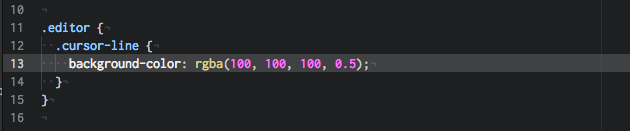

# Faydalı Atom Eklentileri

## [Emmet](https://atom.io/packages/emmet)
Kısa yolları kullanarak hızlı bir şekilde HTML kodları yazmamızı sağlıyor.

```ul>(li>a)*5``` yazıp <kbd>TAB</kbd> tuşuna basarsak şunu elde ederiz:

```html
<ul>
   <li><a href=""></a></li>
   <li><a href=""></a></li>
   <li><a href=""></a></li>
   <li><a href=""></a></li>
   <li><a href=""></a></li>
 </ul>
```
Bunu yazarsak:


Bunu elde ederiz:


## [Minimap](https://atom.io/packages/minimap)
Sayfanın tam kaynak kodunu ekranın sağında göstermek için kullanılır.


## [Highlight Selected](https://atom.io/packages/highlight-selected)
Highlight-selected, Sublime Text veya Notepad++ gibi anahtar kelimenin veya değişkenin üzerine çift tıkladığınızda aynı kelimeleri çerceve içine alır. Aynı kelimeleri hızlı ve güvenilir bir şekilde bulmanızı sağlar. Satır satır aramanızı engeller.


## [Sublime Style Column Selection](https://atom.io/packages/sublime-style-column-selection)
Bu eklenti kodları satırları sütun bazında bozmadan kopyalamaya olanak sağlıyor. Tek yapmanız gereken <kbd>Alt</kbd> tuşuna basarak kopyalama yapmak.


## [File Icons](https://atom.io/packages/file-icons)
File-icons, dosyaların türlerini solda ağaç görünümünde ve sekme sıralamasında dosya isminin solunda küçük iconla gösterir.


## [Atom Beautify](https://atom.io/packages/atom-beautify)
HTML, CSS, PHP başta olmak üzere daha pek çok dilde çalışabilen bu eklenti kodların dizilimini düzelterek okunabilir hale getirmekte. Böylece kodlar daha düzgün, sıralı ve okunabilir hale geliyor. <kbd>CTRL</kbd> + <kbd>SHIFT</kbd> + <kbd>P</kbd> basılması yeterlidir.


## [Color Picker](https://atom.io/packages/color-picker)

Color-picker, editör üzerinde renk paleti kullanmanızı sağlar. Color-picker’ı kullanmak için sağ tıklayabilir veya <kbd>CMD/CTRL</kbd>+<kbd>SHIFT</kbd>+<kbd>C</kbd> kısayolunu kullanabilirsiniz.


## [Markdown Preview Plus](https://atom.io/packages/markdown-preview-plus)

Bu paket sayesinde markdown ile yazdığınız dosyayı tarayıcıya gerek duymadan editör içinde görebiliyorsunuz. Çalıştırmak için <kbd>CTRL</kbd>+<kbd>SHIFT</kbd>+<kbd>M</kbd> veya packpages sekmesinden Markdown Preview Plus menusüne gelip Toggle Preview ile çalıştırabilirsiniz.


## [Minimap Highlight Selected](https://atom.io/packages/minimap-highlight-selected)
Highlight selected paketi gibidir. Seçilen kelimelerin minimap üzerinden gösterilmesini sağlar.


## [Auto Close HTML](https://atom.io/packages/autoclose-html)
HTML taglarını otomatik olarak kapatır.


## [Highlight Line](https://atom.io/packages/highlight-line)
Editördeki aktif satırı vurgular.




## [Git Time Machine Package](https://atom.io/packages/git-time-machine)
Bu paket, Git kullandığınız projelerinizde zamanda yolculuk etmenizi sağlar.


## [Drag Relative Path](https://atom.io/packages/drag-relative-path)
Dosyaları elle yazmak yerine, sürekleyerek otomatik sayfaya eklememizi sağlıyor.


## [Teletype for Atom](https://atom.io/packages/teletype)
Geliştiricilerin çalışma alanlarını ekip üyeleriyle paylaşmalarını ve kod üzerinde gerçek zamanlı olarak işbirliği yapmalarını sağlayan bir Atom paketi.


## [Todo Show](https://atom.io/packages/todo-show)
Kod dosyaları içinde, programcının yapacağını unutmamak amacıyla aldığı notların (Örnek: TODO, FIXME, CHANGED, XXX, IDEA, HACK, NOTE, REVIEW, NB, BUG, QUESTION, COMBAK, TEMP) toplanarak listelenmesini sağlar.
Mac OSX'de kısayolu: <kbd>CTRL</kbd> + <kbd>SHIFT</kbd> + <kbd>T</kbd>  Windows ve Linux'de kısayolu: <kbd>ALT</kbd> + <kbd>SHIFT</kbd> + <kbd>T</kbd>


