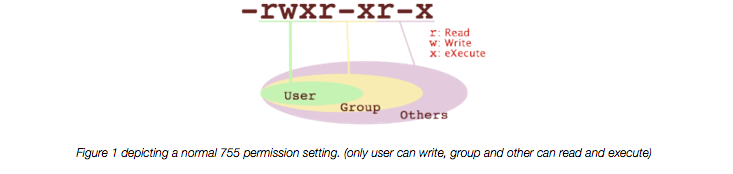
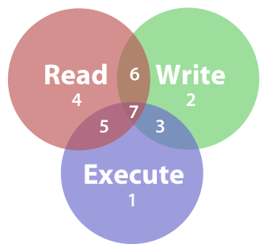
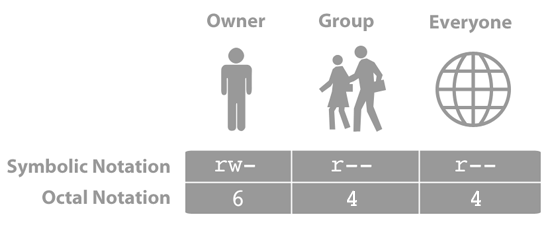
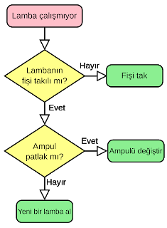

### İnternetin  Tarihi
İnternet'in tarihi,  1950'lerde bilgisayarların gelişmesi ile başlar. Paket ağlarının ilk tasarımları ABD, İngiltere ve Fransa'daki çeşitli laboratuvarlarda şekillenmiştir.

60'ların başında ABD Savunma Bakanlığı tarafından desteklenen ağ çalışmalarından birisi, İnternet Protokolü'nü (IP) kullanan ilk ağ olan ARPANET'tir. ARPANET üzerinden ilk mesaj, Los Angeles'taki Kaliforniya Üniversitesi (UCLA)'daki Profesör Leonard Kleinrock'un laboratuvarından, Stanford Araştırma Enstitüsü(ISR)'de bulunan bir bilgisayara gönderildi.

1960'ların sonlarında ve 1970'lerin başlarında birçok haberleşme protokolü kullanılarak ARPANET, NPL network , CYCLADES, Merit Network, Tymnet ve Telenet gibi paket-anahtarlamalı ağlar geliştirildi. Donald Davies, İngiltere Ulusal Fizik Laboratuvarı'nda dünyada kendi sınıfında bir ilk olan paket-anahtarlamalı bir ağ kurarak, paket anahtarlamalı ağ teorisini pratiğe dönüştüren ilk kişi oldu.Bu çalışma İngiltere'de kendisinden sonraki 20 yıl boyunca yapılacak çalışmalar için bir mihenk taşı oldu.  

### Hyper Text Transfer Protocol - HTTP
İnternet araçlarıyla bilginin sunucudan kullanıcıya ne şekilde ve nasıl aktarılacağını belirten bir araçtır.

### World Wide Web - WWW
World Wide Web belgeler ve diğer web kaynaklarının  URL'ler tarafından tanımlandığı, köprü metin bağlantılarıyla birbirine bağlandığı ve internet
üzerinden erişilebileceği bir bilgi alanıdır.
World Wide Web internet üzerinden çok sayıda belge, bilgi, dokümanlara ulaşmak için kullanılan bir internet hizmetidir.

### Domain Name System - DNS
DNS (Domain Name System) tarayıcınızın adres çubuğuna girdiğiniz site ismini, girmek istediğiniz sitenin gerçekte ikamet
ettiği IP adresine çeviren ve internette gezinmeyi tahmin edemeyeceğiniz kadar kolaylaştıran oldukça yararlı bir
sistemdir. Örneğin hiç kimse şu anda Google'ın ikamet adresi olan 74.125.224.83 adresini tarayıcısına yazmaz.
Onun yerine www.google.com yazar ve DNS sunucusu, bu adresi IP adresine yönlendirir.


### İstemci Nedir ?
İstemci dediğimiz şey, sunucudan istekte bulunan, sunucudaki verileri kullanabilen yapılardır. Örnek olarak bir
web sayfasını verebiliriz.İstemci konumundaki web sayfası, sunucu(server) dan bir istekte bulunur ve bunun
sonucunda sunucu,istenen verileri istemciye ulaştırır.

### Sunucu Nedir ?
Sunucu ise bu bilgileri tutan bilgisayarlardır. Bunların donanımla,yüksek performansla çalışmaları gerekir.
Tanımını özet olarak yaparsak Sunucu, bir ağdaki bilgiyi kullanıcılara (bilgisayarlara) paylaştıran, üzerinde
birçok yazılım çalıştaran, yüksek performansa sahip bilgisayarlardır.


### Hyper Text Markup Language - HTML
Web programlama için gereken en temel dildir. HTML bir programlama dili değil bir betik dilidir. Html kendi başına
çalıştırılamaz, çalıştırılabilmesi için bir web tarayıcısına ihtiyac duyar. Html ile yazı,resim ve videoları birbirine
bağlayıp kullanıcılara sunabiliriz.


## HTTP Durum Kodu (Status Code)
İstemci bir sunucu içeriğine HTTP kullanarak ulaşmaya çalıştığında sunucu yanıtın durumunu belirten bir sayısal kod gönderir. Bazı durumlarda  HTTP durum kodu (HTTP Status Code) istemcinin tarayıcısında da gösterilebilir Örn: 200, 301, 302, 404 ve 500 kodları en yaygın olanlardır.

Aslında, sunucu üzerindeki [detaylı iş akışı](https://www.loggly.com/blog/http-status-code-diagram/) iş akışı oldukça detaylıdır.

Durum kodlarında 1'den 5'e kadar gruplandırılmıştır.

- 1xx     Bilgi
- 2xx     Başarı
- 3xx     Yönlendirme
- 4xx     Tarayıcı Hatası
- 5xx     Sunucu Hatası

### CSS Nedir ?
CSS (Cascading Style Sheet) basit ve kullanışlı bir işaretleme dilidir. CSS diğer bir adıyla Stil şablonları
yazı,resim, bağlantı, kenar çizgileri vb. HTML öğelerine sitil vermek yani biçimlendirmek için kullanılır.
CSS kullanımı sayesinde yüzlerce sayfayı tek bir dosya ile biçimlendirebiliriz. Bu sayede hızlı ve esnek web
sayfaları oluşturabiliriz.


### JAVASCRIPT Nedir ?
JavaScript bize etkileşimli ve dinamik web sayfaları hazırlama imkanı vermektedir. Sözdizimi Java’ya benzese
de Java ve JavaScript birbirinden farklı teknolojilerdir.

### Genel HTTP Yaşam Döngüsü
1. Girilen domain IP adresine çevrilir (DNS)
2. IP adresine TCP bağlantısı (request) açılır
3. Server cevap (response) döner
4. Cevap render edilir

### Domainin IP ‘ye çevrilmesi (DNS)
Tarayıcıya girilen domain (örneğin: www.google.com.tr)
DNS sunucularına sorularak IP adresi bulunur.
Eğer tarayıcı daha önce DNS sorgulaması yaptıysa aynı
domaine istek yapıldığında DNS sorgusu tekrar yapılmaz.
Bu, websitesi hız testlerinde -bir sayfada farklı domainlere
yapılan istekler için- DNS lookup time kriteri olarak
önümüze çıkar.

### IP adresine TCP isteği (request)
Bulunan IP adresine TCP bağlantısı açılıp (request) girilen
domain host header’ı ile gönderilir
Bu örnek için gönderilecek bilgiler aşağıdaki gibidir;
GET / HTTP/1.1
Host: www.google.com
Burada kullanıcının istediği sayfa anasayfa olduğundan “/”
parametresi GET metodu ile gönderilmiştir.

### Server ‘ın cevabı (response)
IP adresinde bulunan server, isteği işleyip cevap
(response) döner.
Server bu isteği işlerken port bilgisine bakarak ilgili web
sunucusuna (iis, apache, nginx) yönlendirir.
Web sunucusu gelen host header’ı ile hangi siteyi
çalıştıracağına karar verip ilgili sitenin kodunu işletir.

### Cevabın ekrana basılması (render)
Cevabı alan browser gelen cevabı ekrana basar (render).
Browser render işleminde html ile layout’u, css ile tasarımı
(renk, imaj vd) oluşturur.
Javascript ise yukarıdaki işlemler yapıldıktan sonra hem
css hem html üzerinde (DOM) değişiklikler yaparak sayfaya
dinamik bir yapı kazandırır.

### Neden Linux ve Komut Satırı

Linux metin işleme araçları — awk, sed ve diğerleri

https://medium.com/@gokhansengun/linux-metin-i%C5%9Fleme-ara%C3%A7lar%C4%B1-awk-sed-ve-di%C4%9Ferleri-d53b27ab692b

Neden komut satırını öğrenmek lazım?

https://medium.com/@atarikguney/neden-komut-sat%C4%B1r%C4%B1n%C4%B1-%C3%B6%C4%9Frenmek-laz%C4%B1m-f7c708bbaa1b

### Kullanıcı Yetkileri








### Developer RoadMap
https://github.com/kamranahmedse/developer-roadmap
### PHP Giriş Eğitimi
https://learnxinyminutes.com/docs/tr-tr/php-tr/
### HTML Giriş Eğitimi
https://learnxinyminutes.com/docs/html/
### CSS Giriş Eğitimi
https://learnxinyminutes.com/docs/tr-tr/css-tr/
### SQL Giriş Eğitimi
https://learnxinyminutes.com/docs/sql/
Örnek DB: https://github.com/datacharmer/test_db

### How Browser Work?
https://superuser.com/questions/31468/what-exactly-happens-when-you-browse-a-website-in-your-browser
### How web works?
https://github.com/vasanthk/how-web-works
### What happens when you type google.com into your browser and press enter
https://github.com/alex/what-happens-when
### Online php komut uygulaması
http://sandbox.onlinephpfunctions.com/
### SQL Notları
https://www.netsparker.com/blog/web-security/sql-injection-cheat-sheet/
Limit ve Offset
```sql
$sql = "SELECT * FROM Orders LIMIT 10 OFFSET 15";
```
With PHP, you can connect to and manipulate databases.

MySQL is the most popular database system used with PHP.
What is MySQL?

    MySQL is a database system used on the web
    MySQL is a database system that runs on a server
    MySQL is ideal for both small and large applications
    MySQL is very fast, reliable, and easy to use
    MySQL uses standard SQL
    MySQL compiles on a number of platforms
    MySQL is free to download and use
    MySQL is developed, distributed, and supported by Oracle Corporation
    MySQL is named after co-founder Monty Widenius's daughter: My

The data in a MySQL database are stored in tables. A table is a collection of related data, and it consists of columns and rows.

Databases are useful for storing information categorically. A company may have a database with the following tables:

    Employees
    Products
    Customers
    Orders

### 5 Dakikada BOOTSTRAP


## Algoritma Nedir ?
Algoritma, belli bir problemi çözmek veya belirli bir amaca ulaşmak için tasarlanan yol anlamına gelir, matematikte ve bilgisayar biliminde bir işi yapmak için tanımlanan, bir başlangıç durumundan başladığında, açıkça belirlenmiş bir son durumunda sonlanan, sonlu işlemler kümesine denir.



## Ağaçlar (tree)
Bir graf şayet bağlı grafsa ve hiç döngü içermiyorsa bu grafa ağaç adı verilir.
Bilgisayar bilimlerinin önemli veri tutma yöntemlerinden birisi de ağaçlardır. Buna göre veriler bir ağaç yapısına benzer şekilde (kök gövde yapraklar) tutulur.


Örneğin yukarıdaki ağaç tasvirinde 7 düğümden (node) oluşan ve yapraklarında (leaf) 4 düğüm bulunan bir ağaç gösterilmiştir. Bu ağacın derinliği (depth) 2 dir ve her seviyenin(level) değeri yanında verilmiştir. Ağaçların 1 tane başlangıç düğümü bulunur ve bu başlangıç düğümüne kök(root) denilir.

Ağaç yapısı, Parent - Child ilişkisi içinde veri saklama için güzel bir örnektir. ROOT çoğunlukla 0 (sıfır) kodu ile anılır.

ID - ParentID - Etiket'den oluşan 3 sutunlu bir veri tablosu yapısı ile tutulamayacak hiyerarşik veri yoktur ve bu yöntem sıklıkla kullanılır.

Yukarıdaki görselde özel olarak yukarıdaki ağacın her düğümünden sadece ikişer alt düğüme bağlantı bulunduğu için bu ağaca ikili ağaç (binary tree) adı da verilebilir.

### Örnek Linkler
Front End:
https://frontendmasters.com/books/front-end-handbook/2018/

User Interface:
http://uigoodies.com/icons-symbols.html
