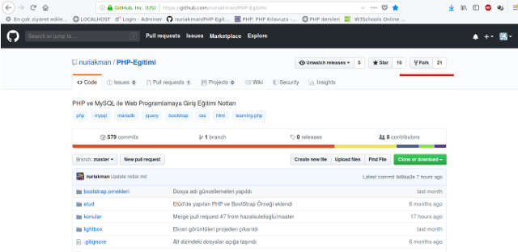

# GitHub Projelerine Katkıda Bulunmak

Bu sayfada olduğunuza göre bilgiye değer veriyorsunuz demektir. Ve bilindiği üzere bilgi paylaştıkça çoğalır ve öğrenmenin en iyi yöntemlerinden biri de öğretmektir.

Sizler de GitHub da görmüş olduğunuz bu proje başta olmak üzere bir çok projeye katkı sağlayarak kendinizin ve diğer insanların gelişmesini sağlayabilirsiniz.

Aşağıdaki adımları sırayla takip ederek bir GitHub projesine nasıl katık sağlayabileceğimizi öğreneceğiz. Tabii ki önce bir GitHub hesabımız olması gerekli.

1) Önce katkıda bulunmak istediğimiz BAŞKA projenin sayfasına gidilir.
Ör: - https://github.com/nuriakman/PHP-Egitimi
Sağ üst köşeden FORK (Çatalla) yapılır. Yani orijinal kaynağın bir kopyası bizim hesabımıza çatallanmış, kopyalanmış olur.

2) Sonra projenin KENDİ GitHub sayfanıza FORK' lanmış (Çatallanmış) haline gidip, sağ taraftaki CLONE (KOPYALA) düğmesine tıklanır ve açılan bağlantıdan projenin URL'si (adresi) kopyalanır.

3) Sonra yerelde yani kendi makinenizde çalışacağız klasöre gidip, (Ör: HTML vb. içinde) sağ tuş ile bir terminal açılır. Açılan sayfaya şu komut
ile "git clone github.com/projeadi" proje dosyaları bilgisayarınıza kopyalanmış olur.

4) Daha sonra inen dosyalarda nereleri değiştirmek istiyorsanız, bir editör aracılığıyla bunu yapabilirsiniz.
Ör: Atom editörü için File -> Open Folder menüsünden indirdiğimiz PHP-EGITIMI klasörünü seçebiliriz.

5) Daha sonra Atom editöründe yaptığımız değişiklikleri ekranın sağ alt köşesindeki GitHut / x file ibaresi bulunan düğmeye tıklayarak açılan pencereden değişiklik yaptığımız dosyaları görebiliriz.

6) STAGE ALL (Hepsini Sahnele) düğmesi ile at sahneye/platforma alınır. Değişikliklere ait açıklama girilip COMMIT (işlem/taahhüt) düğmesine basılır ve son olarak en alttaki PUSH (Yürüt) düğmesiyle kendi sayfamızdaki projeye gönderilir ve güncellenmiş olur.

7) Daha sonra tarayıcıdan GitHub.com sitesi üzerinden sol taraftaki NEW PULL REQUEST (Yeni Çekim Talebi) düğmesine tıklıyoruz.

8) Açılan pencerede az önce göndermiş olduğumuz değişiklikleri görürüz, son kontrolleri yapıp, başlık ve açıklama girip sayfanın altındaki CREATE PULL REQUEST (Çekme Talebi Oluştur) düğmesine tıklarız. Projeye ait kendi sayfamızdaki değişiklikler, ana proje sahibine gönderilmiş olur.

9) Ana proje sahibi sizin gönderdiğiniz commitleri (işlemleri) kontrol edip, uygun gördüklerini MERGE ile BİRLEŞTİRİR.

Bu şekilde siz de projede CONTRIBUTOR (Katkı Sağlayıcı) listesine dahil olmuş olursunuz.
